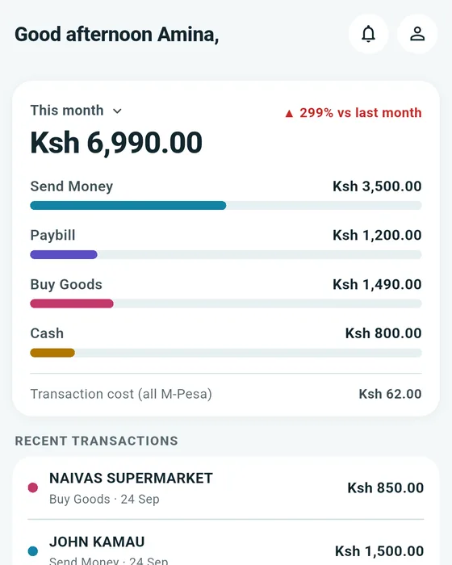
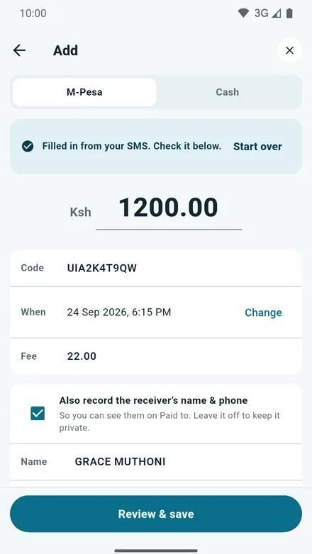
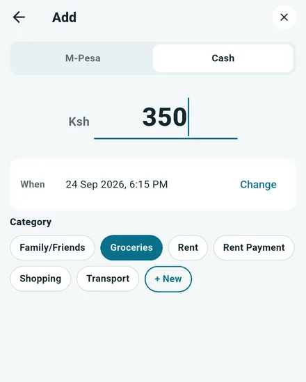

# mmogo

[](https://github.com/Joshynsky/mmogo/releases/latest)
[](https://github.com/Joshynsky/mmogo/releases)
[](LICENSE)

An Android app for seeing where your M-Pesa money goes (the name is short for "My Money Goes"). You paste an M-Pesa message and mmogo reads the amount, who you paid, the code, the date and the transaction cost, then fills in an entry for you to check. You can also type an entry or log a cash payment. It sorts, totals and charts what you've entered. Everything stays on your phone: no account, no server, no tracking.

<p>
  
  
  
</p>

**[Download for Android](https://joshynsky.github.io/mmogo/)** from the website, or get `mmogo.apk` from the [latest release](https://github.com/Joshynsky/mmogo/releases/latest). It isn't on the Play Store, so see [Install](#install-android) for the few prompts Android shows.

mmogo is an independent project. It is not made by, or connected to, Safaricom or M-Pesa. It is an early release built by one person, so expect some rough edges.

## Why it exists

I could never say where my money went. I'd have enough at the start of the month, and then somewhere in the middle I'd be in Fuliza with no clear idea how I got there. A friend had the same problem, so I started building something to answer that one question.

I didn't research the space properly first. When I did, I found that M-Pesa trackers already exist, with plenty of users, and some do more than mmogo does today (Mpesa: Ledger and Monee, for example). They are also on the Play Store and mmogo isn't, so it starts behind. What mmogo offers is a different set of trade-offs: you paste the message yourself, so it needs no SMS permission and no permissions at all; it works offline; it keeps no balance and no account; and the code is open. If that suits you, try it. If another app suits you better, that's a fair choice too.

## What you can do

- **Add an entry three ways:** paste an M-Pesa message (Send Money, Paybill and Buy Goods are read for you), type it yourself, or log a cash payment. You always check an entry before it is saved.
- **Sort your spending:** give every entry a category such as Groceries, Rent or Transport, and make your own. Tick "Always use" and the next payment to the same person or paybill is filled in for you.
- **See where it went:** Home shows this month (or today, this week and more) with a bar for each type of payment and the transaction costs. Analytics breaks it down by day, week, month, year or any range, with a chart you can tap and swipe.
- **See who you pay most:** Paid to ranks the people, paybills and shops you pay, with search, filter and sort.
- **Fix mistakes:** swipe a row to edit or delete it, with Undo. Deleted entries wait in Recently deleted so you can restore them.
- **Make it yours:** three colour palettes (light and dark follow your phone), a short guided tip on each page, a name for the Home greeting, and **Export CSV** through the share sheet.

## Privacy

- Your data is stored in a local SQLite database on the device. There are no accounts and no server.
- mmogo reads **only the message you paste**. It picks out the amount, receiver, code, date and transaction cost. It has no access to your SMS inbox or any other message.
- It **never saves your M-Pesa balance**. The balance in the message is ignored: it isn't picked out, stored or shown. The message text isn't kept either, only the fields above.
- The release app requests **no permissions** (not even internet). `INTERNET` appears only in the debug and profile manifests that Flutter's tooling needs.
- Android auto-backup is switched **off**, so your data is not copied to Google Drive. The flip side: there is no automatic restore on a new phone, and uninstalling the app erases your data. Use **Export CSV** to keep a copy. Backup and restore are planned.

## Install (Android)

Get `mmogo.apk` from the [website](https://joshynsky.github.io/mmogo/) or the latest [GitHub Release](https://github.com/Joshynsky/mmogo/releases/latest). mmogo isn't on the Play Store, so Android and Chrome ask you to confirm a few things. They are all expected:

1. **Chrome says "File might be harmful".** Tap **Download anyway**. Chrome says this about every APK.
2. **Open the file from your file manager** (Files, then Downloads). Android asks to allow installs from unknown apps: allow it for the file manager, not for Chrome.
3. **Play Protect may say "App blocked to protect your device".** It hasn't seen this developer before. Tap **More details**, then **Install anyway**.

If the download freezes at 100%, cancel it and type `github.com/Joshynsky/mmogo/releases/latest/download/mmogo.apk` into Chrome's address bar. This happened on a phone that had the GitHub app installed: the app took over the link and the download never finished.

To check your download, compare its SHA-256 with the value published next to the release:

```
sha256sum mmogo.apk        # Linux / macOS / Git Bash
certutil -hashfile mmogo.apk SHA256     # Windows
```

## Feedback

Found a bug, or want something added? [Open an issue](https://github.com/Joshynsky/mmogo/issues/new). If a message didn't parse, paste it in with the receiver's name and phone number blanked out.

## Status

An early release, under the [MIT License](LICENSE). See the [releases page](https://github.com/Joshynsky/mmogo/releases) for the current version and what changed.

Planned next: backup and restore (uninstalling currently erases your data), then tracking money you receive, Profile in the bottom bar with Settings inside it, and a lighter Add form. Reading M-Pesa messages automatically, without pasting, is something I want to look at after that, if it can be done without asking for broad SMS access.

---

# For developers

Built with Flutter. Android only for now (Android id `io.github.joshynsky.mmogo`).

## Run it from source

You need the [Flutter SDK](https://docs.flutter.dev/get-started/install) (Dart `^3.10.7`).

```
flutter pub get
flutter run                # a connected Android device, or -d windows
flutter analyze
flutter test -j 1          # run the tests one file at a time
```

A debug build fills an empty database with sample entries so you can explore the screens without real messages. Release builds never do this.

## Releasing

Release builds are signed with a private key that lives **outside** this repository.

1. Create a keystore once (`keytool -genkeypair ... -alias mmogo`) and keep the file and its passwords somewhere safe, with a backup in a second place. If the key is lost, installed apps can never be updated.
2. Create `android/key.properties` (gitignored) with `storePassword`, `keyPassword`, `keyAlias` and `storeFile` (the path to the keystore).
3. Bump `version:` in `pubspec.yaml` and `AppInfo.version` in `lib/app_info.dart` together (a test fails if they drift).
4. `flutter build apk --release`, then name the result `mmogo.apk` and publish its SHA-256 next to it.
5. Publish a GitHub Release with `mmogo.apk` attached. The website's download buttons use `releases/latest/download/mmogo.apk`, so they follow the newest release on their own. The version, size and SHA-256 text in `docs/index.html` is written by hand and must be updated to match.

Without `android/key.properties` a release build is left unsigned; it never falls back to the debug key.

## Project layout

```
lib/
  data/        SQLite access: schema, DAOs (transactions, classifications, counterparties, analytics, export) and prefs
  domain/      pure Dart logic: SMS parsing, period maths, counterparty keys, formatting, Paid to grouping
  ui/
    screens/   one folder per busy screen (add/, analytics/, paid_to/, home/) plus the smaller screens
    shell/     the tab bar and page scaffolds
    theme/     palettes (light and dark) and the palette switch
    widgets/   shared widgets (cards, chips, bottom sheet, the guided-tour overlay, pickers)
test/          mirrors lib/
assets/        onboarding walkthrough images and the app icon
docs/          the landing page, served by GitHub Pages (index.html and img/)
brand/         icon sources and the script that builds them
```

Each large screen is a small "shell" that owns the state and data loading, with its sections in separate files. Files start with a `§AREA.PIECE` marker in their doc comment so you can search for a section by name.

## Tests

The suite covers the SMS parser, the period and grouping logic, every DAO against an in-memory SQLite database, and the screens as widget tests (light and dark). `flutter analyze` is kept clean.
